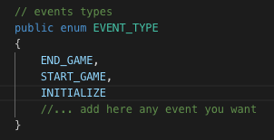
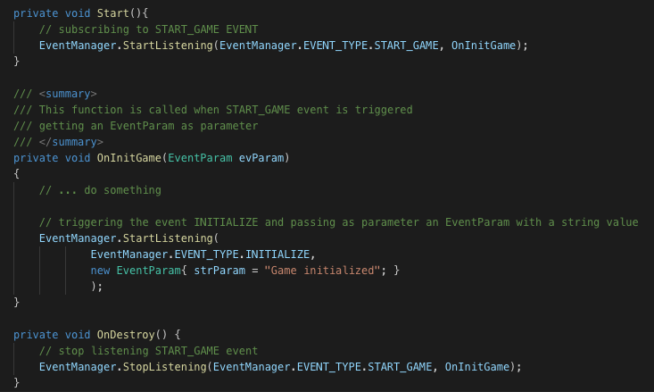
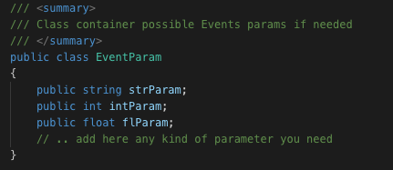

# Unity Event Manager
Manage all events located in only one file

## Description
Some projects need to use a lot of events for different situations, with this manager it will easy to subscribe, unsubscribe and trigger all of events we need.

## How to use it?
The **EventManager.cs** class has an enum which will contain all the events which our project will use:

Once we have all the events inside the enum we could start to use the manager:
* If we need to subscribe an event we could do it with the function **StarListening**
* For unsubscribe just using the function **StopListening** will work
* And finally to trigger an event, use the function **TriggerEvent**

When you are triying to trigger an event you have to ad as parameter an object EventParam, so who is listenting to this event will receive this param.
You can modify the class to add more type of calues if you need it:

